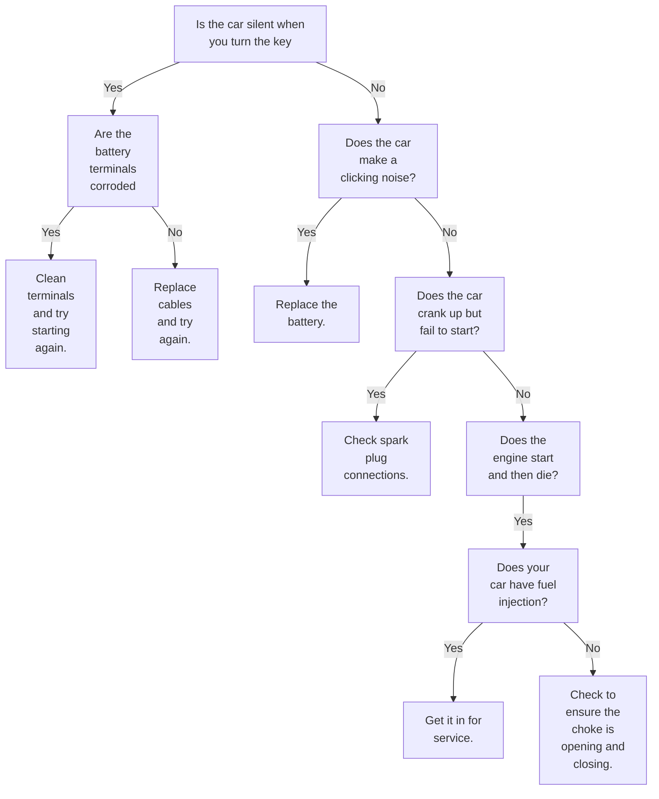

# README

A small project demonstrating a use case for the [NRules](https://nrules.net) rules engine in C#.

- Demonstrates use of the Fluent DSL for rule definitions

- Forward chaining of rules via the IContext Update() method

## Dependencies

- DotNet SDK 8.0

## Running the project

> dotnet run

Answer prompts with 'y' or 'n' to see the rules in action.

